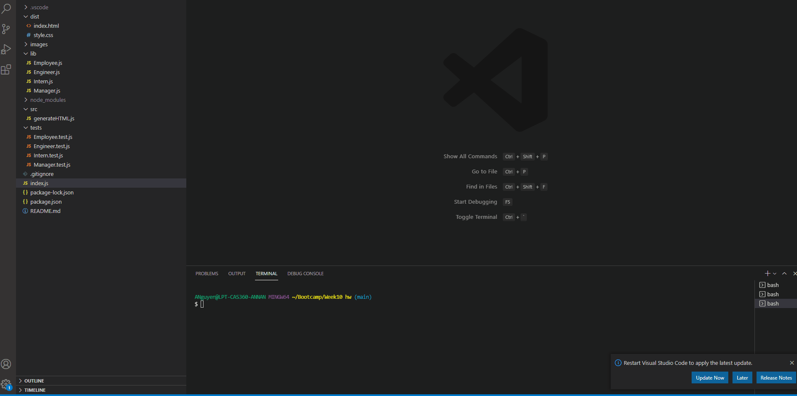
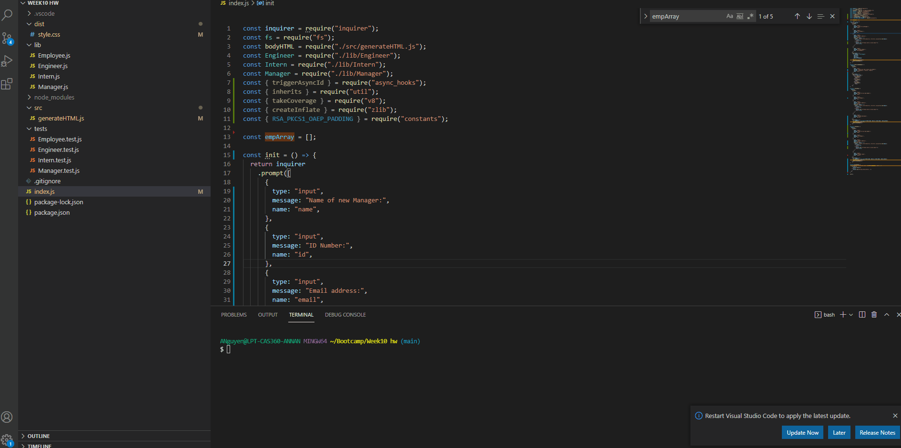

# Team Profile Generator

## Table of Contents

- [Description](#description)
- [Installation Instructions](#installation-instructions)
- [Test Instructions](#test-instructions)
- [Demonstration](#demonstration)
- [Questions](#questions)

## Description

This is a team profile generator that allows users to add new team members by answering questions via command prompt. A HTML file will be created once users finish adding in details of each member of their team. To run the appication, users will need to install all required dependancies.


## Installation Instructions

Packages required:

- Inquirer
- Jest

To install necessary dependencies, run the following command(s):

```bash
npm i
```

## Test Instructions

To run tests run the following command(s):

```bash
npm test
```



## Demonstration

Run the following prompt in terminal to initiate questions:

```bash
node index.js
```



## Questions

If you have any questions about the repo, please open an issue or contact me directly at n.annabich@gmail.com. You can find more of my work <a href="https://github.com/AnnaNguyen1" target="_blank">here</a>.
