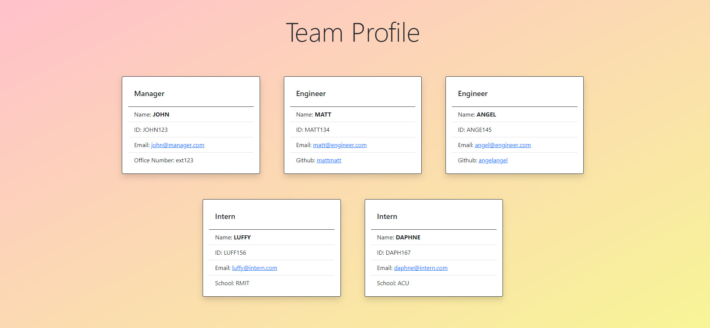

# Team Profile Generator

## Table of Contents

- [Description](#description)
- [Installation Instructions](#installation-instructions)
- [Test Instructions](#test-instructions)
- [Demonstration](#demonstration)
- [Questions](#questions)

## Description

This is a team profile generator that allows users to add new team members by answering questions via command prompt. A HTML file will be created once users finish adding in details of each member of their team. To run the appication, users will need to install all required dependancies.



## Installation Instructions

To install necessary dependencies, run the following command(s):

```bash
npm i
```

## Test Instructions

To run testm run the following command(s):

```bash
npm test
```

## Demonstration
